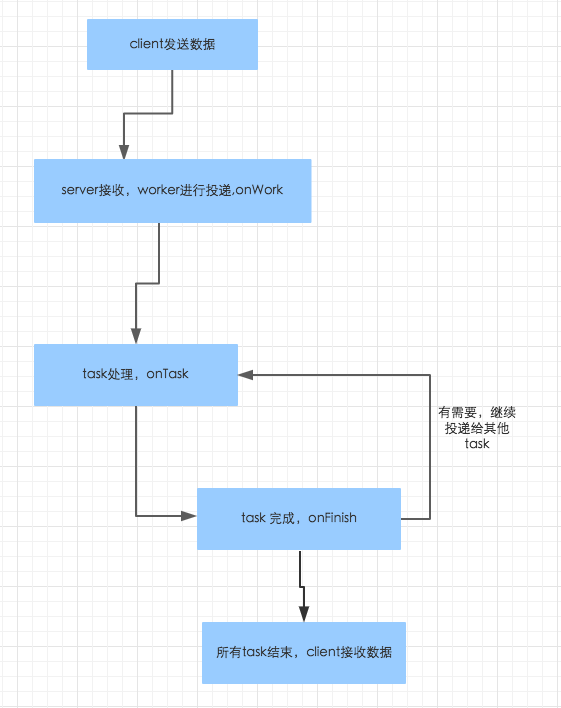
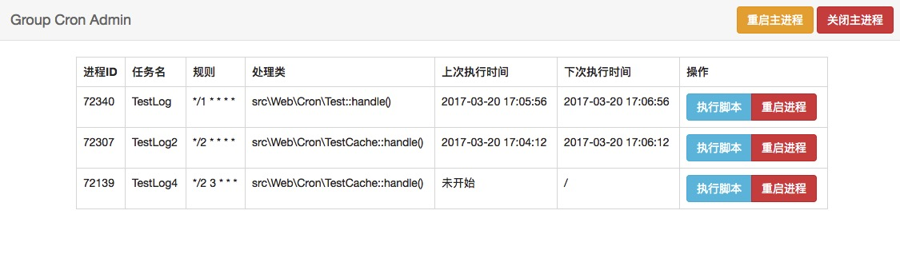

# Group

[](https://codeclimate.com/github/fucongcong/framework)
[](https://travis-ci.org/fucongcong/Group)

#### 编写此框架的意义:

首先现在流行的框架有很多。编写这个框架，其实可以说这个框架的特色，与其他框架的区别。

- 支持普通业务场景的功能开发，4层架构。
- async多task处理任务支持，业务逻辑复杂性能差？多进程帮你解决性能问题！
- 一键启动rpc服务，不与主业务冲突，轻松完成后期SOA转行，支持TCP HTTP Websocket协议
- 一键启动定时任务，还在用系统自带的cronjob？（支持子进程重启,自动重启,防止内存泄漏）
- 一键启动队列任务，还在自己集成队列服务？
- 目录结构清晰简单
- 轻量级。框架的实际代码目前应该在5千行左右
- 包管理composer支持。
- 架构可扩展性，规范的命名空间化，自己扩展类库随时可行
- Debug工具条支持，找性能问题？找你的sql哪里慢了？找视图层渲染变量？找模板？debug条一览无余
- laravel,symfony2有的控制台，我们也有！数据库脚本自动化！自动生成基础结构！自定义扩展控制台！

##### [使用swoole http server](https://github.com/fucongcong/ssos/blob/master/php/group%E6%A1%86%E6%9E%B6%E6%B5%8B%E8%AF%95.md)

##### 未来版本开发计划:
- i18n支持
- 一些常用类库的丰富（中文转拼音，验证码...）


轻量级框架，通俗易懂，快速上手。点击右上star!
PHP交流群：390536187
联系我Email: cc@xitongxue.com,coco.fu@clothesmake.com

#### 1.[Group框架简介](#user-content-group框架简介)

- [后端框架介绍](#user-content-框架介绍)

#### 2.[快速开始](#user-content-快速开始)
- [服务器配置文件](#user-content-1服务器配置文件)
- [进入框架](#user-content-2进入框架)
- [目录结构](#user-content-3目录结构)

#### 3.[路由篇](#user-content-路由篇)

#### 4.[控制层](#user-content-控制层)

#### 5.[服务层](#user-content-服务层)

#### 6.[数据层](#user-content-数据层)

#### 7.[视图层](#user-content-视图层)

#### 8.[框架基础服务](#user-content-框架基础服务)
- [Async](#user-content-async)
- [Container](#user-content-container)
- [Cache](#user-content-cache)
- [Config](#user-content-config)
- [Console](#user-content-console)
- [CronJob](#user-content-cronjob)
- [Debug](#user-content-debug)
- [Exception](#user-content-exception)
- [EventDispatcher](#user-content-eventdispatcher)
- [FileCache](#user-content-filecache)
- [Filesystem](#user-content-filesystem)
- [Route](#user-content-route)
- [Request](#user-content-request)
- [Response](#user-content-response)
- [Session](#user-content-session)
- [Log](#user-content-log)
- [Queue](#user-content-queue)
- [Test](#user-content-test)
- [RPC](#user-content-rpc)

#### 9.[单元测试](#user-content-单元测试)

## Group框架简介

#### 环境依赖
- PHP > 5.5
- Redis
- Mysql
- Nginx or Apache
- Composer

#### 扩展模块
- [PhpRedis](https://github.com/phpredis/phpredis)
- [Swoole，建议最新版本，1.8.0以上](https://github.com/swoole/swoole-src)
- [beanstalkd](https://github.com/kr/beanstalkd) 

#### 框架介绍
（1）模版引擎：twig （symfony2使用的模版引擎）

（2）分层：Dao（模型层）,Service（服务层），Controller（控制层），View（视图层）

## 快速开始
#### 准备
进入目录，执行以下命令

	git clone https://github.com/fucongcong/Group.git

	cd Group

	composer install
#### 更新框架版本（部分涉及到配置文件的需要更新git的master最新分支）

    composer update


#### 1.服务器配置文件

[Ngnix配置](https://github.com/fucongcong/Group/blob/master/doc/ngnix_server_config.txt)
[Ngnix&Apache配置](https://github.com/fucongcong/Group/blob/master/doc/nginx_proxy&apache.txt)

#### 2.进入框架

访问 http://localhost:8081 进入框架主页

#### 3.目录结构
- app (脚本文件)
- asset (前端文件)
- config (配置文件)
- doc (文档)
- runtime (缓存)
- src (你的网站核心代码)
    - Admin (后台分组)
        - Controller （控制层）
        - View (视图层)
        - routing.php （路由配置）
    - Async (异步服务)
    - Dao （模型层）
	- Services （服务层）
	- Web (前台分组)
        - Command (控制台命令扩展)
	 	- Controller （控制层）
	 	- Cron （异步定时器）
        - Listeners （监听器）
        - Queue （队列任务）
        - View (视图层)
	 	- routing.php （路由配置）
    - Demo（可以自行添加分组）
- index.php(主入口)
- server.php(swoole http server 入口)
- rpc_server.php(rpc server 启动脚本)

## 路由篇
（1）自定义路由

（2）动态参数绑定

（3）restful API 风格

示例：

```php
<?php
return array(

	    'homepage'=>[
	    	'pattern' => '/',
	    	'controller' => 'Web:Home:Default:index',
	    ],

	    'group'=>[
	    	'pattern' => '/group/{id}',
	    	'controller' => 'Web:Group:Group:test',
	    	'methods' => 'GET',
	    ],

	    'create_group'=>[
	        'pattern' => '/group/{id}',
	        'controller' => 'Web:Group:Group:index',
	        'methods' => 'POST',
	    ],

	    'user_group'=>[
	    	'pattern' => '/user/{id}/group/{groupId}',
	    	'controller' => 'Web:Group:Group:test',
	    	'methods' => 'GET',
	    ],
);
```


## 控制层

（1）第一个控制器

```php
	<?php
	namespace src\web\Controller\Home;

	use Controller;

	//请继承Controller
	class DefaultController extends Controller
	{
	    //一个action 与route对应
	    public function indexAction()
	    {
	        //渲染模版 模版的启始路径可在config的view.php配置
	        return $this -> render('Web/Views/Default/index.html.twig');
	    }

	}

	?>
```

（2）如何获取路由传过来的参数？详见Request与Route服务

```php
<?php
namespace src\Web\Controller\Group;

use Controller;
use Request;
//在后面我们可以跟上路由定义好的参数，$id
public function testAction(Request $request, $id)
{
    // echo $id; echo "<br>";

    //可以获取整个路由地址
    $uri = $this -> route() -> getUri();
    //获取所有参数
    $parameters = $this -> route() -> getParameters();
    //获取参数名
    $parametersName = $this -> route() -> getParametersName();
    //获取当前action的名称
    $action = $this -> route() -> getAction();
    //获取系统支持的请求方法
    $methods = $this -> route() -> getMethods();

    $currentMethod = $this -> route() -> getCurrentMethod();
    //获取当前时区
    $timezone = $this -> getContainer() -> getTimezone();
    //获取当前运行环境
    $environment = $this -> getContainer() -> getEnvironment();
    //这里和Service服务层交互
    echo $this->getGroupService()->getGroup(1);
    //传入模板
    return $this -> render('Web/Views/Group/index.html.twig',array(
        'uri' => $uri,
        'parameters' => $parameters,
        'parametersName' => $parametersName,
        'action' => $action,
        'methods' => $methods,
        'currentMethod' => $currentMethod,
        'timezone' => $timezone,
        'environment' => $environment
        ));
}
public function getGroupService()
{
	//创建一个Service实例
    return $this -> createService("Group:Group");
}
```

## 服务层
#####（1）简单介绍一下目录结构
- Group (示例)
    - Impl （服务层实现的接口）
    - Rely （定义服务之间的依赖关系）
- GroupService.php(接口)

#####服务层主要用于处理数据层与控制层间数据的业务处理。只要继承Service类就可以了。

    GroupService.php
```php
<?php
namespace src\Services\Group;

interface GroupService
{
    public function getGroup($id);
}
```

    /Rely/GroupBaseService.php

```php
<?php
namespace src\Services\Group\Rely;

use Service;
//定义在Rely文件下的依赖
abstract class GroupBaseService extends Service
{
    //获取数据层的对象实例
    public function getGroupDao()
    {
        return $this->createDao("Group:Group");
    }

    //获取其他服务的对象实例
    public function getUserService()
    {
        return $this -> createService("User:User");
    }
}
```

    /Impl/GroupServiceImpl.php

```php
<?php
namespace src\Services\Group\Impl;

use src\Services\Group\Rely\GroupBaseService;
use src\Services\Group\GroupService;

class GroupServiceImpl extends GroupBaseService implements GroupService
{
    //实现定义的服务层接口方法
    public function getGroup($id)
    {
        return $this -> getUserService() -> getUser(1);
        //return $this->getGroupDao()->getGroup($id);
    }

}
```

## 数据层
##### 支持主从配置(详见配置文件)

##### 如何使用

```php
<?php

    namespace src\Dao\Group\Impl;

    use Dao;
    use src\Dao\Group\GroupDao;

    class GroupDaoImpl extends Dao implements GroupDao
    {
        //定以数据表
        protected $tables="groups";

        //具体方法
        public function getGroup($id)
        {
            $sql="SELECT * FROM {$this->tables} WHERE id=:id LIMIT 0,1";
            //动态参数绑定
            $bind = array('id' => $id);
            //读取默认配置
            //$group = $this->getDefault()->fetchOne($sql, $bind);

            //读取写服务器配置，如果没有指定具体参数，随机写入分配的服务器
            //$group = $this->getWrite('master1')->fetchOne($sql, $bind);
            //$group = $this->getWrite('master2')->fetchOne($sql, $bind);

            //读取读服务器配置，如果没有指定具体参数，随机读取分配的服务器
            //$group = $this->getRead()->fetchOne($sql, $bind);
            return $group ? $group : null;
        }

    }
```

##### 支持的语法

##### fetch(*)
```php
    $pdo = $this->getDefault();

    $stm  = 'SELECT * FROM test WHERE foo = :foo AND bar = :bar';
    $bind = array('foo' => 'baz', 'bar' => 'dib');
    $result = $pdo->fetchAll($stm, $bind);

    // fetchAssoc() returns an associative array of all rows where the key is the
    // first column, and the row arrays are keyed on the column names
    $result = $pdo->fetchAssoc($stm, $bind);

    // fetchGroup() is like fetchAssoc() except that the values aren't wrapped in
    // arrays. Instead, single column values are returned as a single dimensional
    // array and multiple columns are returned as an array of arrays
    // Set style to PDO::FETCH_NAMED when values are an array
    // (i.e. there are more than two columns in the select)
    $result = $pdo->fetchGroup($stm, $bind, $style = PDO::FETCH_COLUMN)

    // fetchObject() returns the first row as an object of your choosing; the
    // columns are mapped to object properties. an optional 4th parameter array
    // provides constructor arguments when instantiating the object.
    $result = $pdo->fetchObject($stm, $bind, 'ClassName', array('ctor_arg_1'));

    // fetchObjects() returns an array of objects of your choosing; the
    // columns are mapped to object properties. an optional 4th parameter array
    // provides constructor arguments when instantiating the object.
    $result = $pdo->fetchObjects($stm, $bind, 'ClassName', array('ctor_arg_1'));

    // fetchOne() returns the first row as an associative array where the keys
    // are the column names
    $result = $pdo->fetchOne($stm, $bind);

    // fetchPairs() returns an associative array where each key is the first
    // column and each value is the second column
    $result = $pdo->fetchPairs($stm, $bind);

    // fetchValue() returns the value of the first row in the first column
    $result = $pdo->fetchValue($stm, $bind);

    // fetchAffected() returns the number of affected rows
    $stm = "UPDATE test SET incr = incr + 1 WHERE foo = :foo AND bar = :bar";
    $row_count = $pdo->fetchAffected($stm, $bind);
```
##### 数组转换

```php
    $pdo = $this->getDefault();

    $stm = 'SELECT * FROM test WHERE foo IN (:foo)'

    $array = array('foo', 'bar', 'baz');
    $cond = 'IN (' . $pdo->quote($array) . ')';

    $bind_values = array('foo' => $array);
    $sth = $pdo->perform($stm, $bind_values);
    echo $sth->queryString;
    // "SELECT * FROM test WHERE foo IN ('foo', 'bar', 'baz')"
```

## 视图层
##### 基础的twig语法文档请查看twig官方(twig.sensiolabs.org/documentation)
##### 简单介绍框架内部扩展好的方法

    {{ asset("asset/css/bootstrap.min.css") }} asset方法主要是用于获取前端js,css文件的地址

    {{ url('create_group', {'id':1}) }} 用于匹配路由,第一个参数是routing配置文件的主键，后面是参数，以数组形式

    {{ render('Web:Group:Group:index') }} 在一个twig文件内部，可以render其他controller下面的模块。

    {{ 1454566745|smart_time }} 时间戳转换

##### 开启csrf验证防止跨站攻击

    //在post 请求时，如果在session.php配置文件中开启csrf_check参数，默认会检查csrf_token参数。你可以在表单中加入以下参数
    <form method="post" action="{{url('create_group', {'id':1})}}">
    
      <input type="hidden" name="csrf_token" value="{{ csrf_token() }}">

      <button type="submit">提交</button>
    </form>

## 框架基础服务

## Async
#### Async服务是可以无缝接入到任务业务中的，你可以使用框架中的任何服务在实现handle方法中。 Async是基于swoole的task-server服务，用于将慢速任务丢给异步task去处理，从而解决性能问题.(建议更新到swoole最新版本 测试环境为v1.9.2)。

##### 使用场景：单进程业务复杂，可以拆分为多个子进程同时进行业务数据封装，此过程是异步阻塞的，客户端还是会阻塞等待服务端返回数据。
##### 修改配置 config/async.php

##### 开启async server

    app/async user_server 

##### 注意如果要开启守护进程模式，不要设置swoole config的daemonize为true(相对路径会出错),应该如下:

    app/async user_server &

##### 执行client查看运行结果

    php src/Async/User/clent.php


#### 完整流程介绍



##### 使用注意
- 使用全局变量，局部静态变量时，内存释放的问题。否则有可能内存泄漏！
- 共享单个数据库对象，对数据库长连接丢失时的断线重连问题。要做好断线重连机制(Group框架内部已经做了)
- 控制好worker与task的数量。比例。防止出现worker接受大量tcp连接时，task处理不过来，导致数据返回超时。

##### 详细介绍一下配置

```php
    <?php
    return [

        'client' => [],
        //配置swoole异步服务器
        'server' => [

            //可以配置多个server，注意请监听不同的端口。
            //serverName
            'user_server' => [

                'serv' => '0.0.0.0',
                'port' => 9519,

                //swoole server配置，请根据实际情况调整参数.不详细解释
                'config' => [  
                  //more
                ],

                'onWork' => [
                    [   
                        //client端发送过来的处理命令
                        'cmd' => 'getUserInfo',
                        //处理器
                        'handler' => 'src\Async\User\Work\UserHandler',
                    ],

                ], 

                //如果work中的handler有任务丢给task
                'onTask' => [
                    [   
                        //work传来的命令
                        'cmd' => 'getUserInfo',
                        //task处理器
                        'handler' => 'src\Async\User\Task\UserHandler',
                        //task结束时需要执行的处理器
                        'onFinish' => 'src\Async\User\Finish\UserHandler',
                    ],
                    [   
                        //work传来的命令
                        'cmd' => 'getUserAddress',
                        //task处理器
                        'handler' => 'src\Async\User\Task\UserAddressHandler',
                    ],

                ], 
            ],
        ],
    ];

```

#### 详细介绍一下onWork

##### onWork，很明显server端在接受client数据时，触发的事件。分为两个参数cmd(命令名称)和handler(处理的类)。onWork事件旨在将任务分发到task

```php
    'onWork' => [
        [   
            //client端发送过来的处理命令
            'cmd' => 'getUserInfo',
            //处理器
            'handler' => 'src\Async\User\Work\UserHandler',
        ],

    ], 
```
#### src/Async/User/Work/UserHandler.php,请继承Group\Async\Handler\WorkHandler类，实现handle()即可。

##### 获取client端发送的数据

```php   
    
    $this -> getData();

```

##### 投递task任务

```php   
    
    $cmd = "getUserInfo";
    $this -> task($cmd, $data);

```

##### 完整示例

```php
    <?php

    namespace src\Async\User\Work;

    use Group\Async\Handler\WorkHandler;

    class UserHandler extends WorkHandler
    {
        public function handle()
        {
            $data = $this -> getData();
            foreach ($data as $value) {
                $this -> task($value);
            }
        }
    }
```


##### 投递完task任务，我们来看看onTask事件

```php
    'onTask' => [
        [   
            //work传来的命令
            'cmd' => 'getUserInfo',
            //task处理器
            'handler' => 'src\Async\User\Task\UserHandler',
            //task结束时需要执行的处理器
            'onFinish' => 'src\Async\User\Finish\UserHandler',
        ],
        [   
            //work传来的命令
            'cmd' => 'getUserAddress',
            //task处理器
            'handler' => 'src\Async\User\Task\UserAddressHandler',
        ],

    ], 
```

#### 上面的work丢过来任务后，我们可以写一个src/Async/User/Task/UserHandler.php来处理task进程要做的事情。请继承Group\Async\Handler\TaskHandler类，实现handle()即可。

##### 获取work发送的数据

```php   
    
    $this -> getData();

```

##### 返回处理好的数据

```php   
    
    return $this->finish($data);

```

##### 完整示例

```php
    <?php

    namespace src\Async\User\Task;

    use Group\Async\Handler\TaskHandler;

    class UserHandler extends TaskHandler
    {
        public function handle()
        {   
            $users = [
                1 => 'user1', 
                2 => 'user2', 
                3 => 'user3', 
                4 => 'user4', 
                5 => 'user5', 
                6 => 'user6', 
                7 => 'user7', 
                8 => 'user8', 
                9 => 'user9', 
                10 => 'user10'
            ];

            $data = $this -> getData();
            $userId = $data['data'];
            $user = $users[$userId];

            if ($user == 'user1') {
                $user = [];
                $user['name'] = $users[$userId];
                $user['cmd'] = 'needAddress';
            }

            return $this->finish($user);
        }
    }


```

#### task任务完成之后,我们就要写最后的finish事件了(如果不定义finish事件，系统会自动返回task返回的数据)。把数据丢回给client端。我们可以写一个src/Async/User/Finish/UserHandler.php来处理task进程要做的事情。请继承Group\Async\Handler\FinishHandler类，实现handle()即可。

##### 获取task最后return回来的数据

```php   
    
    $this -> getData();

```

##### client端的demo 请看src/Async/User/client.php


##### 投递task任务(在结束一个task任务之后，你还可以继续投递给其他的task)

```php   
    
    $cmd = "getUserAddress";
    $this -> task($cmd, $data);

```

##### 完整示例

```php
    <?php

    namespace src\Async\User\Finish;

    use Group\Async\Handler\FinishHandler;

    class UserHandler extends FinishHandler
    {
        public function handle()
        {
            $user = $this -> getData();
            if (isset($user['cmd']) && $user['cmd'] == 'needAddress') {
                $this -> task("getUserAddress", $user['name']);
            } else {
                return $user;
            }
        }
    }


```
##### 等到所有task执行完成时，系统会自动返回所有处理完成的数据。

#### 在框架中使用,Group的Async封装了call方法作为client端与server端通信,包含了4个参数

```php
    
    $server = 'user_server'; //config配置的serverName
    $cmd = "getUserInfo"; // 传给server的指令
    $data = [1,2,3,4,5,6,7,8,9,10]; // 数据
    $needRecvData = true; //默认为true，false的话server端不会返回数据

    \Async::call($server, $cmd, $data, $needRecvData);

```

## Container
#####Container是一个基础的容器，一些系统变量会存放于这里

## Cache

##### 目前只支持了Redis得cache，使用请在cache.php配置中配置redis

```php

    use Cache;
    //key value expireTime
    Cache::set('ha', 123, 60);
    //也可以这样
    Cache::redis() -> set('haa', 123, 60);

    Cache::get('ha');
    Cache::hSet($hashKey, $key, $data, $expireTime);
    Cache::hGet($hashKey, $key);
    Cache::hDel($hashKey, $key);
    Cache::hDel($hashKey);

    //现在的类库方法还未扩展完全，目前只有以上方法
    //你可以使用Cache::redis() 获取redis实例，这是一个PhpRedis的实例，api－》(https://github.com/phpredis/phpredis)
```

## FileCache

##### 文件形式的缓存

```php

    use FileCache;

    //默认路径是放在runtime/cache/
    FileCache::set('test.php', ['testdfata' => 'datadata']);
    //指定路径
    FileCache::set('test.php', ['testdfata' => 'datadata'], 'runtime/cache/test/');

    FileCache::get('test.php');
    FileCache::get('test.php', 'runtime/cache/test/');

```

## Config

##### 用于查找config目录下得配置

```php

    use Config;

    //文件名::key
    Config::get('app::environment');

    //也可以重新设置ests
    Config::set('app', 'environment', 'dev');
```

## EventDispatcher

##### 事件监听Listener

#####先写一个监听KernalResponseListener
```php
<?php

namespace src\web\Listeners;

use Listener;
use Event;

class KernalResponseListener extends Listener
{
    public function setMethod()
    {
        return 'onKernalResponse';
    }

    //触发时执行
    public function onKernalResponse(Event $event)
    {
        echo 'this is a KernalResponse Listener';
    }
}

```

##### 绑定监听

```php

    use EventDispatcher;

    $listener = new KernalResponseListener();

    //定义一个事件名称，触发的监听器，和一个重要指数
    EventDispatcher::addListener('kernal.responese', $listener, 10);

    EventDispatcher::removeListener('kernal.responese', $listener);

    EventDispatcher::hasListeners('kernal.responese');

    //最后可以在需要的时候派发事件
    EventDispatcher::dispatch('kernal.responese');
    EventDispatcher::dispatch('kernal.responese', $envet);

```

##### 事件绑定器Subscriber

##### 写一个subscriber
```php

    use Group\Events\EventSubscriberInterface;

    class TestSubscriber implements EventSubscriberInterface
    {   
        //注册多个监听事件
        public function getSubscribedEvents()
        {
            return [

                //eventName  =>  listener
                'test.start' => 'onTestStart',
                //eventName  =>  listener, priority
                'test.stop' => ['onTestStop', 100],
                //eventName  => array  listener, priority
                'test.doing' => [
                    ['onDoA'],
                    ['onDoB', 225],
                ],
            ];
        }

        public function onTestStart(\Event $event)
        {
            echo 'onTestStart';
        }

        public function onTestStop(\Event $event)
        {
            echo 'onTestStop';
        }

        public function onDoA(\Event $event)
        {
            echo 'onDoA';
        }

        public function onDoB(\Event $event)
        {
            echo 'onDoB';
        }
    }

```
##### 添加到EventDispatcher
```php
        $subscriber = new TestSubscriber();

        EventDispatcher::addSubscriber($subscriber);

        EventDispatcher::hasListeners('test.start')
        EventDispatcher::hasListeners('test.stop')
        EventDispatcher::hasListeners('test.doing')

        EventDispatcher::dispatch('test.start');
        EventDispatcher::dispatch('test.stop');
        EventDispatcher::dispatch('test.doing');

        EventDispatcher::removeSubscriber($subscriber);
```

## Request

##### 参照symfony2的Request服务
```php
    public function testAction(Request $request, $id)
    {
        //get
        $request -> query -> get('xxx');
        $request -> query -> all()

        //post
        $request -> request -> get('xxx');
        $request -> request -> all()
        

        //file 
        $request -> file -> get('xxxx');
    }
```

## Response

##### 常规
```php
    public function testAction(Request $request, $id)
    {
        return new \Response('这是文本');
    }
```

##### json格式
```php
    public function testAction(Request $request, $id)
    {
        return new \JsonResponse('这是文本');
    }
```

##### 重定向
```php
    public function testAction(Request $request, $id)
    {
        return $this -> redirect('http://xxxx');
    }
```

## Session

##### Session 目前支持2中方式存储，默认存放在runtime/sessions下，也可以开启redis driver，将session存在redis中，详见配置
```php

    use Session;

    Session::set('group', 'good');
    Session::get('group');
    Session::remove('group');
    Session::has('group');
    Session::clear();
    Session::all();
    Session::isStarted();

    $attributes = ['group' => 'hello'];
    Session::replace($attributes);
```
## Log

##### 默认存放于runtime/log
```php

    use Log;

    Log::debug('123',['user'=>1]);
    Log::info('123',['user'=>1]);
    Log::notice('123',['user'=>1]);
    Log::warning('123',['user'=>1]);
    Log::error('123',['user'=>1]);
    Log::critical('123',['user'=>1]);
    Log::alert('123',['user'=>1]);
    Log::emergency('123',['user'=>1]);

    //默认model是web.app,也可以自定义
    Log::emergency('123',['user'=>1],'web.admin');

```

## Console

#### 控制台的使用方法

    //进入根目录 执行
    app/console


    ----------------------------------------------------------

         -----        ----      ----      |     |   / ----
        /          | /        |      |    |     |   |      |
        |          |          |      |    |     |   | ----/
        |   ----   |          |      |    |     |   |
         -----|    |            ----       ----     |

     ----------------------------------------------------------

     使用帮助: 
     Usage: app/console [options] [args...] 

     generate:service name       生成一个自定义service
     generate:controller  name    生成一个自定义controller
     sql:generate                生成一个sql执行模板(存放于app/sql)
     sql:clean                清除lock文件,您可以再次执行migrate脚本中的命令
     sql:migrate   [default|write|read|all] [name]  参数可不填，执行sql模板(默认会向default服务器执行.第二个参数只有当第一个参数为write|read时，才会生效,如果不填，默认为write|read下面所有服务器)
     sql:rollback   [default|write|read|all] [name]  参数可不填，执行sql模板(默认会向default服务器执行.第二个参数只有当第一个参数为write|read时，才会生效,如果不填，默认为write|read下面所有服务器)

#### 自定义控制台
##### 配置文件config/app.php  
```php
    //扩展console命令行控制台
    'console_commands' => [
        'log:clear' => [
            'command' => 'src\Web\Command\LogClearCommand', //执行的类
            'help' => '清除日志', //提示
        ],
    ],
```
## CronJob
##### 异步定时器介绍(支持秒级定时)
##### 依赖：[Swoole1.7.14以上版本](https://github.com/swoole/swoole-src)

##### 配置文件config/cron.php
```php
    return [
        //是否为守护进程
        'daemon' => true,
    
        'cache_dir' => 'runtime/cron',

        'class_cache' => 'runtime/cron/bootstrap.class.cache',

        //log路径
        'log_dir' => 'runtime/cron',

        //每个定时任务执行到达该上限时，该子进程会自动重启，释放内存
        'max_handle' => 5,

        //定时器轮询周期，精确到毫秒
        'tick_time' => 1000,

        'job' => [

            [
                'name' => 'TestLog',//任务名
                'time' => '*/1 * * * *',//定时规则 分 小时 天 周 月
                'command' => 'src\Web\Cron\Test',//执行的类库
            ],

            [
                'name' => 'testCache',
                'time' => '24 */2 * * *',//定时规则 分 小时 天 周 月
                'command' => 'src\Web\Cron\TestCache',
            ],

            [
                'name' => 'testSql',
                'time' => '*/2 * * * *',//定时规则 分 小时 天 周 月
                'command' => 'src\Web\Cron\TestSql',
            ],

        ],
    ];
```

##### 执行的类库示例
```php

    namespace src\Web\Cron;

    use Group\Cron\CronJob;

    //继承CronJob父类
    class Test extends CronJob
    {   
        //实现handle方法即可  框架内部所有服务都可正常使用
        public function handle()
        {
            \Log::info('nihao', ['time' => date('Y-m-d H:i:s', time())], 'cron.job');
        }

    }
```
##### 执行命令

    app/cron start|restart|stop|status|exec (job name)|rejob (job name)|server

##### 图形界面管理


    app/cron server &  (访问 127.0.0.1:10008 即可)


## Queue
##### 异步队列服务介绍
##### 依赖：[Swoole1.7.14以上版本](https://github.com/swoole/swoole-src) 
##### 依赖：[beanstalkd](https://github.com/kr/beanstalkd) 

##### 向队列插入任务
```php

    use Queue;

    //队列名
    $tube = 'testjob1';
    //具体数据
    $data = '这是第一个队列任务';
    //就这么简单 队列已经被塞入内存
    //$priority, $delaytime, $lifetime 可不填。默认会取配置的参数
    $priority = 1;
    $delaytime = 0;
    $lifetime = 60;
    Queue::put($tube, $data, $priority, $delaytime, $lifetime);

```
##### 配置config/queue.php  
##### 开启异步队列服务处理任务
    
    app/queue start|restart|stop

##### 最后看看我们的任务怎么写
```php
    <?php

namespace src\Web\Queue;

use Group\Queue\QueueJob;

class TestJob extends QueueJob
{   
    public function handle()
    {      
        //队列任务的id号
        $jobId = $this -> jobId;
        //你在插入队列时的数据
        $jobData = $this -> jobData;
        //后面就可以写处理的逻辑了
        \Log::info('queue handle job'.$this -> jobId, ['time' => date('Y-m-d H:i:s', time())], 'queue.job');
    }

}
```
##### 队列图形化管理工具[beanstalk_console](https://github.com/ptrofimov/beanstalk_console) 

## RPC
##### 一个启动命令完成rpc服务！！不与其他业务冲突！！
##### 依赖：[Swoole](https://github.com/swoole/swoole-src)
##### 启用config/app.php 中的serviceProviders里面的RpcServiceProvider
##### 配置config/rpc.php文件,
##### 服务启动 php rpc_server.php &
##### 服务热重启 php rpc_server.php -s reload
##### 注意服务会默认开放src/Services下面所有服务的公有函数的调用
##### 使用
```php
    
    //指调用User模块下UserService 的getUser方法， 最后跟上参数
    $res = \Rpc::call('User:User', 'getUser', [1]);
    //也可以这样
    $res = \Rpc::service('User:User')->getUser(1);

    //错误返回false
    var_dump($res);

```
##### 用途，做soa服务化管理时。用于分布式。


## 单元测试

    phpunit --bootstrap app/test.php src
